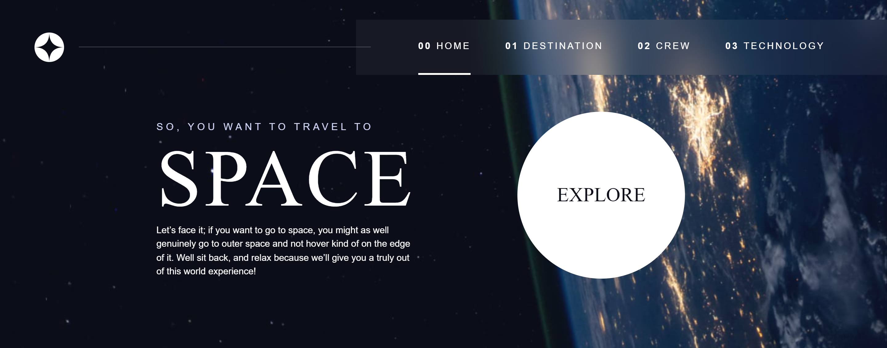

## Space tourism multi-page website

This is a solution to the [Space tourism multi-page website](https://www.frontendmentor.io/challenges/space-tourism-multipage-website-gRWj1URZ3). This project is a fun collaboration with Scrimba and Kevin Powell! If you like, you can follow along and watch Kevin complete the project on Scrimba. Lots to learn!. 

### Screenshot

### Links

- Solution URL: [Repo](https://github.com/sledua/fm_space)
- Live Site URL: [Live GH-pages](https://sledua.github.io/fm_space)
### Built with

**Note: [MDB](https://mdb.pushkaryadav.in/generate) - Markdown Badges - Super cool badges for your projects**  
